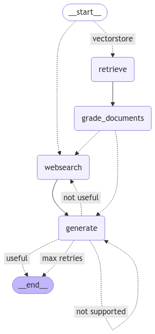

# Adaptive Retrieval-Augmented Generation (RAG) Agent with Groq API and Llama-3.3-70B-Versatile

This project implements an Adaptive RAG agent utilizing the Groq API with the `llama-3.3-70b-versatile` model. The implementation is structured in a Jupyter notebook (`.ipynb`) to facilitate ease of use, interactive exploration, and reproducibility. The approach integrates:

- **Routing**: Employing Adaptive RAG to direct questions to appropriate retrieval methods based on complexity.
- **Fallback Mechanism**: Implementing Corrective RAG to resort to web search when retrieved documents lack relevance.
- **Self-Correction**: Applying Self-RAG to amend answers that exhibit hallucinations or fail to address the query adequately.

## Project Structure

- **Jupyter Notebook**: The project is implemented entirely within a notebook for ease of use and reproducibility.
- **Flowcharts and Visualizations**: Key aspects of the workflow, such as routing and LangGraph structure, are visualized within the notebook.
- **Interactive Code**: Each step, from setting up the environment to executing the workflow, is implemented in individual cells.

## Setup Instructions

1. **Clone the Repository**:

   ```bash
   git clone https://github.com/yourusername/adaptive-rag-agent.git
   cd adaptive-rag-agent
   ```

2. **Open the Jupyter Notebook**:

   Install Jupyter if it's not already installed:

   ```bash
   pip install notebook
   ```

   Then, launch the notebook interface:

   ```bash
   jupyter notebook
   ```

   Open the `adaptive_rag_agent.ipynb` file.

3. **Install Dependencies**:

   Inside the notebook, execute the cell that installs all dependencies. Ensure you have Python 3.8 or higher installed. The notebook includes a setup cell with:

   ```bash
   !pip install -r requirements.txt
   ```

4. **Set Environment Variables**:

   The notebook includes a cell for setting up the required API keys and configurations:

   ```python
   import os

   os.environ["GROQ_API_KEY"] = "your_groq_api_key"
   os.environ["TAVILY_API_KEY"] = "your_tavily_api_key"
   os.environ["LANGSMITH_API_KEY"] = "your_langsmith_api_key"
   os.environ["LANGCHAIN_TRACING_V2"] = "true"
   os.environ["LANGCHAIN_PROJECT"] = "groq-llama-rag"
   ```

5. **Configure the Llama-3.3-70B-Versatile Model**:

   The notebook includes a cell for configuring the `llama-3.3-70b-versatile` model via the Groq API:

   ```python
   from groq import GroqModel

   model_id = "llama-3.3-70b-versatile"
   llm = GroqModel(model_id=model_id, api_key=os.getenv("GROQ_API_KEY"))
   ```

6. **Run the Workflow**:

   Each step of the workflow, from data ingestion to the Adaptive RAG pipeline, is implemented as executable cells. Simply run the cells in sequence to execute the workflow.

## Visualizations

### Question-Answering Pipeline Flowchart


*This flowchart outlines the question-answering pipeline, detailing the routing based on relevance, document retrieval and grading, and the decision-making process for determining the answer, including checks for relevance, hallucinations, and accuracy, with a fallback to web search if necessary.*

### LangGraph Structure



*This diagram illustrates the LangGraph structure after creating the graph nodes and edges, showcasing the workflow of the Adaptive RAG agent.*

## References

- **LangGraph**: A framework for building language agents as graphs. [GitHub Repository](https://github.com/langchain-ai/langgraph)
- **Adaptive RAG Paper**: [Adaptive-RAG: Learning to Adapt Retrieval-Augmented Large Language Models through Question Complexity](https://arxiv.org/abs/2403.14403)
- **Corrective RAG Paper**: [Corrective-RAG: A Retrieval-Augmented Generation Framework with Corrective Mechanisms](https://arxiv.org/abs/2303.13456)
- **Self-RAG Paper**: [Self-RAG: Self-Reflective Retrieval-Augmented Generation](https://arxiv.org/abs/2304.05128)
- **Groq API Documentation**: [GroqCloud Developer Console](https://console.groq.com/docs/overview)
- **Llama 3.3 70B Model Information**: [Llama (language model) - Wikipedia](https://en.wikipedia.org/wiki/Llama_%28language_model%29)

## Acknowledgments

This project is inspired by the LangGraph tutorial on Adaptive RAG with local models. Special thanks to the authors and contributors of the referenced papers and repositories for their foundational work.
